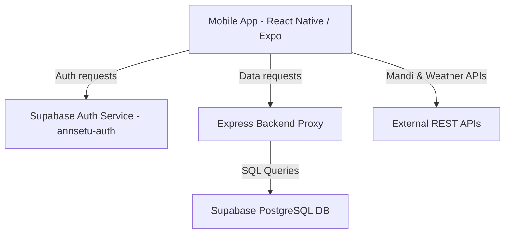

# 🌾 Annsetu: Architectural Division

This document outlines the architectural division, responsibilities, and configuration details for the frontend (mobile) and backend components of the Annsetu Mandi app.

---

## 🏗️ System Overview

Annsetu uses a decoupled architecture where the mobile app handles UI presentation and authentication, while a backend Express server manages data querying and integration with a PostgreSQL database.

---

## 📱 Mobile App (Frontend)
Located in `mobile/`. Built with **React Native (Expo SDK 54)**.

### Responsibilities
- **Authentication**: Gate-keeps access to the app. Connects to the Supabase Auth server (`tbrvuyzjzruysxamiuaz`) to handle sign-in, signup, and session state. Includes a global logout capability.
- **UI & Layout**: Renders Mandi rates, Farmer selector, Dashboard, Storage inventory, and Weather information.
- **Client Storage**: Persists authentication session locally using `AsyncStorage`.

### Key Files
- [App.js](file:///c:/annsetu-mandi/annsetu-mandi/mobile/App.js): Entry point. Subscribes to Supabase auth state and conditionally renders `LoginScreen` or `HomeScreen`. Catch block ensures the spinner does not lock up on storage/fetching errors.
- [mobile/src/services/supabase.js](file:///c:/annsetu-mandi/annsetu-mandi/mobile/src/services/supabase.js): Configures the Supabase client using the `annsetu-auth` credentials (`https://tbrvuyzjzruysxamiuaz.supabase.co`).
- [mobile/src/screens/LoginScreen.js](file:///c:/annsetu-mandi/annsetu-mandi/mobile/src/screens/LoginScreen.js): Handles user sign-in and sign-up flows.
- [mobile/src/screens/HomeScreen.js](file:///c:/annsetu-mandi/annsetu-mandi/mobile/src/screens/HomeScreen.js): Coordinates the tab-based layout and renders the green premium header with a Log Out button.
- [mobile/src/screens/home/FarmerSelector.js](file:///c:/annsetu-mandi/annsetu-mandi/mobile/src/screens/home/FarmerSelector.js): Handles searching and listing farmers, rendering a white header with a Log Out button.
- [mobile/src/screens/home/FarmerDashboard.js](file:///c:/annsetu-mandi/annsetu-mandi/mobile/src/screens/home/FarmerDashboard.js): Displays stock summaries, pending rent dues, aging alerts, quick actions, and a Log Out button.
- [mobile/src/screens/home/ColdStorageTab.js](file:///c:/annsetu-mandi/annsetu-mandi/mobile/src/screens/home/ColdStorageTab.js): Displays cold storage capacity and features a Log Out button.
- [mobile/src/screens/home/ColdStorageMandiPrices.js](file:///c:/annsetu-mandi/annsetu-mandi/mobile/src/screens/home/ColdStorageMandiPrices.js): Sub-component extracted from `ColdStorageTab` to display live mandi rates while keeping file sizes small.
- [mobile/src/services/farmerService.js](file:///c:/annsetu-mandi/annsetu-mandi/mobile/src/services/farmerService.js): Interfaces with the backend proxy server to query farmers, register new farmers, and fetch dynamic notifications.

---

## ⚙️ Express Server (Backend)
Located in `backend/`. Built with **Node.js & Express**.

### Responsibilities
- **Data Proxy**: Acts as a proxy to obscure database connection credentials and communicate securely with the PostgreSQL database.
- **Notification Engine**: Performs dynamic aging and billing calculations to compile alerts for farmers.
- **Aggregations**: Summarizes stock weight/bags and overdue rents.

### Key Files
- [backend/server.js](file:///c:/annsetu-mandi/annsetu-mandi/backend/server.js): Entry point. Mounts CORS, JSON parsing, and api routers.
- [backend/db.js](file:///c:/annsetu-mandi/annsetu-mandi/backend/db.js): Sets up the PostgreSQL connection pool using `DATABASE_URL` pointing to the database project `wkqcwjapitgtgysjjeab`.
- [backend/routes/notifications.js](file:///c:/annsetu-mandi/annsetu-mandi/backend/routes/notifications.js): Processes alerts:
  - Generates **aging alerts** for stock stored in the cold storage for $\ge 90$ days.
  - Generates **rent alerts** for pending invoices near or past their due date.
- [backend/routes/farmers.js](file:///c:/annsetu-mandi/annsetu-mandi/backend/routes/farmers.js): Queries farmer records, balances, and handles registration.
